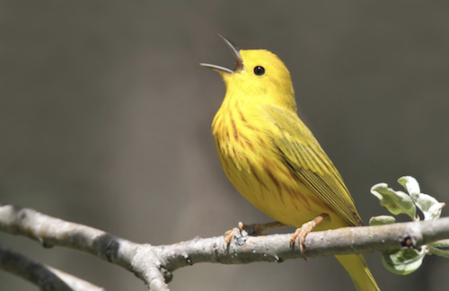

# Project Overview
In this project, I'll classify images from the CIFAR-10 dataset. 
The dataset consists of airplanes, dogs, cats, and other objects. 

# Get the code
You can download the code for this project [here](https://tugan0329.bitbucket.io/downloads/udacity/dl/cifar-10-image-classification.zip)